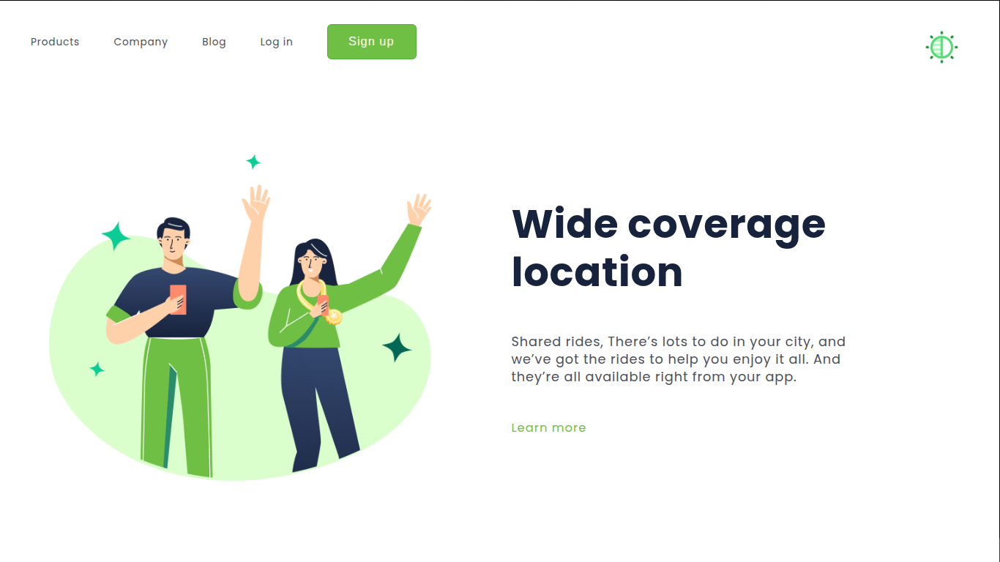
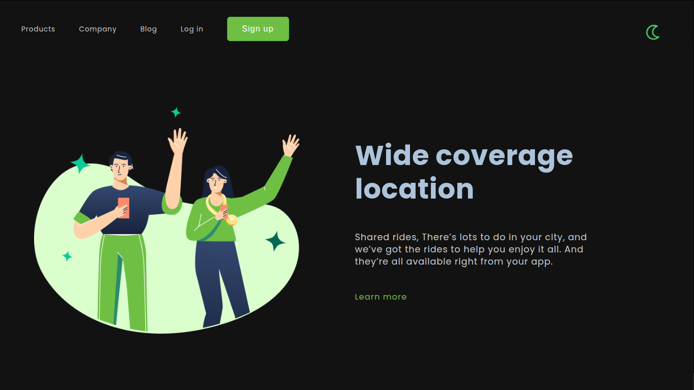
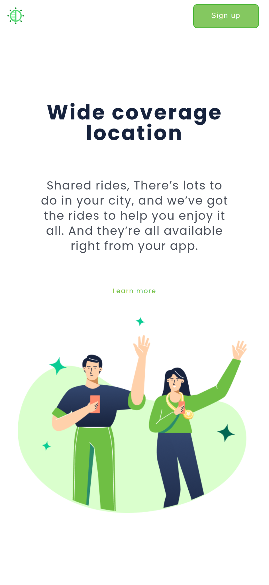
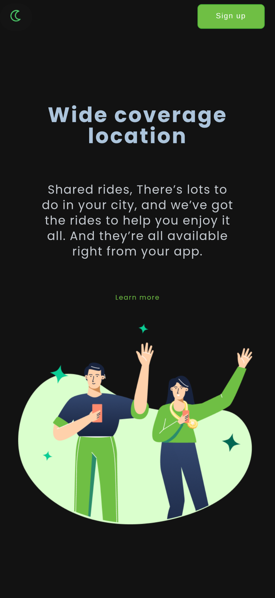

# Wide Coverage Location

Projeto front-end desenvolvido como exercício prático de **HTML, CSS e JavaScript**, a partir de um layout de landing page.

O projeto possui um layout responsivo e uma implementação simples de **Dark Mode**, mas o principal objetivo não é a complexidade visual da aplicação. O foco está na organização e na aplicação de boas práticas de desenvolvimento front-end, especialmente:

- criação e utilização de variáveis CSS;
- separação e organização dos arquivos por responsabilidade;
- estruturação de pastas de forma padronizada;
- nomenclatura consistente para classes e variáveis;
- implementação prática de JavaScript no projeto;
- criação de um **toggle de tema** utilizando JavaScript para adicionar/remover uma classe no elemento `<html>`;
- persistência da preferência de tema com `localStorage`;
- construção de um layout responsivo para diferentes tamanhos de tela.

## Preview

### Desktop — Light Mode



### Desktop — Dark Mode



### Mobile — Light Mode



### Mobile — Dark Mode



## 🎯 Objetivo do projeto

O projeto foi desenvolvido com uma abordagem de **aprendizado e aplicação prática**.

A interface em si é relativamente simples. A intenção principal foi utilizar uma página pequena para praticar conceitos que podem ser aplicados em projetos maiores, como:

> **organização + padronização + reutilização + JavaScript aplicado ao CSS.**

Um dos principais exercícios foi evitar valores de cores espalhados pelo CSS. Em vez disso, as cores são centralizadas em variáveis CSS e reutilizadas pelos componentes da página.

## 🛠️ Tecnologias utilizadas

- **HTML5**
- **CSS3**
  - CSS Variables
  - Flexbox
  - CSS Grid
  - Media Queries
  - `color-mix()`
- **JavaScript**
  - DOM
  - `classList`
  - `localStorage`
- **Google Fonts**
  - Poppins

## 📁 Estrutura do projeto

```text
wide-coverage-location/
│
├── index.html
│
├── assets/
│   │
│   ├── css/
│   │   ├── base/
│   │   │   ├── reset.css
│   │   │   └── variables.css
│   │   │
│   │   └── pages/
│   │       └── home.css
│   │
│   ├── js/
│   │   └── main.js
│   │
│   └── images/
│       ├── preview/
│       │   ├── desktop-light.png
│       │   ├── desktop-dark.png
│       │   ├── mobile-light.png
│       │   └── mobile-dark.png
│       └── ...
│
└── README.md
```

### Organização

A estrutura foi separada por responsabilidade:

**`base/`** — arquivos responsáveis por configurações gerais do projeto, como reset e variáveis.

**`pages/`** — estilos específicos das páginas. Neste projeto, a página principal utiliza `home.css`.

**`js/`** — arquivos responsáveis pela lógica JavaScript.

**`images/`** — recursos visuais utilizados na interface.

Essa separação facilita a manutenção e permite que o projeto cresça sem concentrar todo o código em poucos arquivos.

## 🎨 Variáveis CSS

Um dos principais focos do projeto é a utilização de **CSS Custom Properties (CSS Variables)**.

As cores principais ficam centralizadas em `variables.css`.

Exemplo:

```css
:root {
    --bg-main-color-d: #ffffff;
    --bg-main-hover-d: #808080;

    --font-main-color-d: #17233D;
    --font-text-color-d: #4B505A;
    --font-button-color-d: #ffffff;
}
```

Assim, os componentes não precisam receber valores de cores diretamente.

Por exemplo:

```css
.wrapper {
    background-color: var(--bg-main-color-d);
}
```

Isso facilita alterações futuras e reduz a repetição de valores no CSS.

## 🌙 Dark Mode

O Dark Mode foi implementado utilizando as mesmas variáveis CSS.

A classe:

```css
.dark-theme
```

é adicionada ao elemento `<html>` pelo JavaScript.

As variáveis recebem novos valores quando essa classe está presente:

```css
:root.dark-theme {
    --bg-main-color-d: #121212;
    --bg-main-hover-d: #2A2A2A;

    --font-main-color-d: #acc4db;
    --font-text-color-d: #C5CAD0;
    --font-button-color-d: #FFFFFF;
}
```

Dessa forma, os componentes continuam utilizando as mesmas variáveis, mas o valor utilizado muda de acordo com o tema.

### Fluxo do funcionamento

```text
Usuário clica no botão
        ↓
JavaScript executa classList.toggle()
        ↓
<html> recebe ou remove "dark-theme"
        ↓
CSS identifica :root.dark-theme
        ↓
Variáveis CSS recebem novos valores
        ↓
Interface muda de tema
```

## ⚙️ JavaScript

O JavaScript foi mantido propositalmente simples.

A lógica principal é:

```js
const themeToggle = document.querySelector("#theme-toggle");

const savedTheme = localStorage.getItem("theme");

if (savedTheme === "dark") {
    document.documentElement.classList.add("dark-theme");
}

themeToggle.addEventListener("click", () => {

    const theme =
        document.documentElement.classList.toggle("dark-theme");

    if (theme) {
        localStorage.setItem("theme", "dark");
    } else {
        localStorage.setItem("theme", "light");
    }

});
```

O objetivo dessa implementação é praticar uma integração simples entre **JavaScript e CSS**, sem criar uma lógica excessivamente complexa.

O JavaScript não precisa alterar cada cor individualmente. Ele apenas controla a classe `dark-theme`, enquanto o CSS fica responsável por definir a aparência correspondente.

## 💾 Persistência do tema

A preferência do usuário é armazenada no `localStorage`:

```js
localStorage.setItem("theme", "dark");
```

Quando a página é carregada novamente, a preferência é recuperada e o tema é aplicado novamente.

## 📱 Responsividade

A interface foi desenvolvida pensando em diferentes tamanhos de tela.

No desktop, o conteúdo principal é organizado lado a lado. Em telas menores, o layout se reorganiza para apresentar o conteúdo de forma vertical, colocando o texto antes da imagem.

Foram utilizados recursos como:

- Flexbox;
- CSS Grid;
- unidades relativas;
- `flex-wrap`;
- dimensionamento relativo de imagens e textos;
- Media Queries.

## 🧠 Conceitos praticados

### HTML

- estrutura semântica;
- organização dos elementos;
- separação entre navegação e conteúdo principal;
- utilização de classes para estilização.

### CSS

- CSS Variables;
- organização de estilos;
- nomenclatura de classes;
- Flexbox;
- Grid;
- responsividade;
- `color-mix()`;
- controle de temas.

### JavaScript

- seleção de elementos com `querySelector`;
- eventos com `addEventListener`;
- `classList.toggle()`;
- `classList.add()`;
- manipulação do elemento `<html>`;
- `localStorage`;
- integração entre JavaScript e CSS.

## 🚀 Como acessar

O site está hospedado no Github Pages, que pode ser acessado pelo link abaixo

- https://arthurdeandradehygino-crypto.github.io/Wide-Coverage-Location/

## 📌 Próximos passos

Possíveis evoluções para o projeto:

- melhorar ainda mais a responsividade;
- adicionar transições entre os temas;
- trocar o ícone de sol/lua dinamicamente;
- expandir a utilização das variáveis CSS;
- melhorar a acessibilidade;
- adicionar interações aos elementos da navegação;
- evoluir a estrutura para um projeto maior.

## 📚 Sobre o projeto

Este projeto faz parte do processo de aprendizado de **desenvolvimento Front-end**, com foco em transformar conceitos estudados em uma implementação prática e organizada.

A proposta principal foi utilizar uma aplicação simples para praticar conceitos de organização de código e integração entre **HTML, CSS e JavaScript**, especialmente a utilização de variáveis CSS em conjunto com uma lógica de troca de tema.
